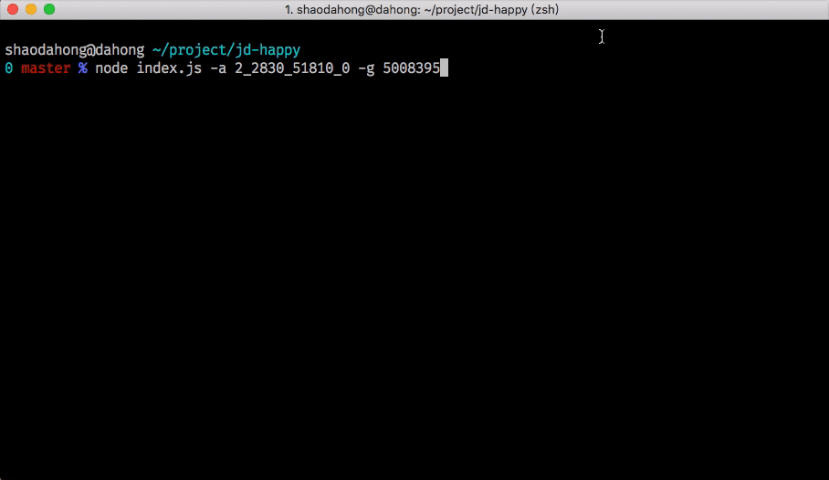

<h1 align="center">JD-HAPPY<h1>

> 部分接口已过期

### 前言

代码实现基于[jd-autobuy](https://github.com/Adyzng/jd-autobuy)

京东有代下单服务，但是会有限制，遇到些商品无法使用代下单，只能收到到货提醒，所以想实现个自动下单功能，以免剁手不成，悔恨不已

但是基本上该功能是没有什么卵用的，只不过看着简单用 node 实现了一下，坑比较少，毕竟前人栽树后人乘凉 :smile:

- [x] 扫码登录
- [x] 根据地区查询商品库存
- [x] 库存>0 时自动下单
- [ ] 支持抢购商品
- [ ] 支持缓存登陆状态（仅本地）

```
   在初始化浏览器……
   初始化完成，开始抓取页面
   页面抓取完成，开始分析页面
   页面参数到手，关闭浏览器

   -------------------------------------
                请求扫码
   -------------------------------------

   二维码未扫描 ，请扫描二维码
   二维码未扫描 ，请扫描二维码
   请手机客户端确认登录
   请手机客户端确认登录
   请手机客户端确认登录
   扫码成功，正在登录
   登录成功

   商品详情------------------------------
   时间：2017-10-26 19:57:51
   商品名：英特尔（Intel） i7 8700K 酷睿六核 盒装CPU处理器
   价格：3999.00
   状态：无货
   连接：http://item.jd.com/5008395.html

   商品详情------------------------------
   时间：2017-10-26 121:37:31
   商品名：英特尔（Intel） i7 8700K 酷睿六核 盒装CPU处理器
   价格：3999.00
   状态：有货
   连接：http://item.jd.com/5008395.html

   开始加入购物车
   商品已成功加入购物车！

   订单详情
   订单总金额：￥3999.00
   寄送至： 上海 浦东新区 长泰广场
   收货人：happy 123****8910

   开始下单
   下单成功,订单号4635622833
   请前往京东商城及时付款，以免订单超时取消
```

### 使用

推荐使用 `yarn`

```bash
$ yarn

$ yarn start -a 2_2830_51810_0 -g 5008395
```

<p align="center">

</p>

### 帮助

```bash
$ yarn start

Usage: node index.js -a 地区编号 -g 商品编号

食用方式: yarn start -a 地区编号 -g 商品编号

选项：
  --version   显示版本号                                                  [布尔]
  -a, --area  地区编号                                                    [必需]
  -g, --good  商品编号                                                    [必需]
  -t, --time  查询间隔ms                                       [默认值: "10000"]
  -b, --buy   是否下单                                            [默认值: true]
  -h, --help  显示帮助信息                                                [布尔]

示例：
  node index.js -a 2_2830_51810_0 -g 5008395

缺少这些必须的选项：a, g
```
